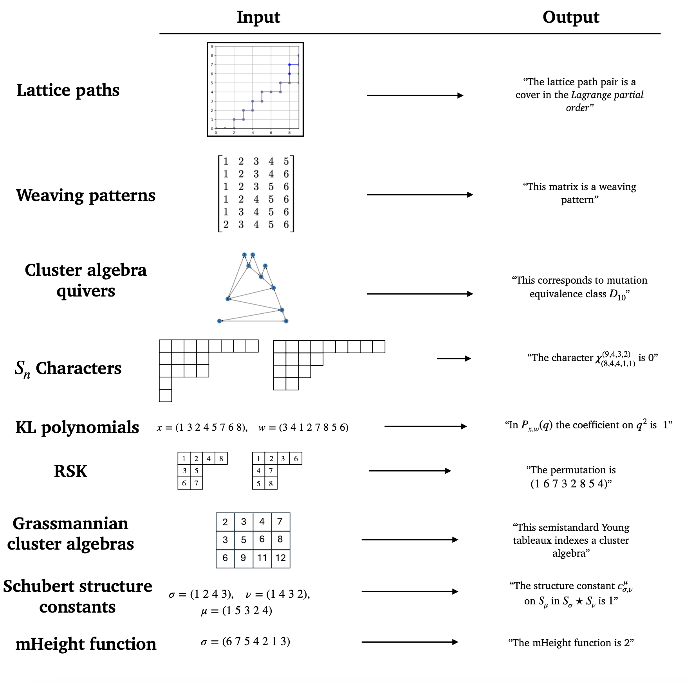

# Algebraic Combinatorics Dataset Repository
## A Collection of Algebraic Combinatorics Datasets for Scientific Discovery in Mathematics
The challenge of sifting through large datasets with the goal of identifying structure and patterns is a common activity in research level mathematics. As an obvious example, many careers have been spent looking for patterns in the set of prime numbers. Since modern machine learning is increasingly capable of pulling subtle patterns out of highly structured, complicated datasets at scale, there is hope that data-driven approaches may be able to accelerate the pace of research in mathematics.

Motivated by this we introduce the **Algebraic Combinatorics Dataset Repository (ACD Repo)**, a collection of datasets drawn from the mathematical domain of algebraic combinatorics, an area of mathematics which studies discrete structures arising from the field of abstract algebra, including representation theory, algebraic geometry, etc.

We have included two types of datasets in these benchmarks:
- **Datasets that capture open problems:** Using machine learning to drive scientific discovery has been a fundamental goal within the AI-community since its inception. One challenge, particularly in mathematics, is that the data supporting such discovery is itself often complicated, requiring a domain expert to collect/generate, preprocess, and explain. To lower the barrier of entry to the machine learning community, we include datasets centered around open problems in algebraic combinatorics. We hope that use of these by the AI-community will translate into progress in mathematics. 
- **Datasets that capture classical or foundational subjects and algorithms in algebraic combinatorics:** On the other hand, there are cases where it is valuable to be able to evaluate ML approaches to mathematics where a solution is known. It might be interesting to understand whether a particular ML algorithm rediscovers a known result and if not, whether there are other approaches that have been missed until now by the mathematical community.

Along with the data, we provide official train/test splits, background information which explains the dataset and problems associated with it, and some baseline performances of models trained and evaluated on our splits. In many cases we was provide the code for generating more data.

### Updates
- July 17, 2025: A paper for the ACD Repo was presented as an oral at ICML 2025
- July 10, 2025: We are in the process of also uploading our datasets onto HuggingFace for more convenient usage

**Contributors:**
- [Herman Chau](https://sites.math.washington.edu/~hchau/) (University of Washington)
- [Helen Jenne](https://hjenne.github.io) (Pacific Northwest National Laboratory)
- [Henry Kvinge](https://hkvinge.github.io) (Pacific Northwest National Laboratory, University of Washington)
- [Davis Brown](https://davisrbrown.com) (Pacific Northwest National Laboratory)
- [Sara Billey](https://sites.math.washington.edu/~billey/) (University of Washington)
- Jackson Warley (Pacific Northwest National Laboratory)
- [Jesse He](https://he-jesse.github.io) (UCSD)

**Point of contact:** Henry Kvinge, acbenchdataset@gmail.com

### Open Problem Datasets
- [**Grassmannian cluster algebras:**](https://github.com/pnnl/ML4AlgComb/tree/master/grassmannian_cluster_algebras) Identify when a rectangular semistandard Young tableau corresponds to a cluster variable in a cluster algebra associated with a Grassmann manifold.
- [**Kazhdan-Lusztig polynomial coefficients:**](https://github.com/pnnl/ML4AlgComb/tree/master/kl-polynomial_coefficients) Kazhdan-Lusztig polynomials, which are parametrized by two permutations, are known to carry extensive combinatorial information yet in many ways remain mysterious. The goal of this task is to predict the coefficients on these polynomials from the indexing permutations alone.
- [**Lattice path posets:**](https://github.com/pnnl/ML4AlgComb/tree/master/lattice_path_posets) The set of lattice paths from $(0,0)$ to $(n,n-1)$ which only take steps east and north and never cross the diagonal $y = \frac{n}{n-1}x$ capture the combinatorics of a range of important phenomena in mathematics. One way to study the set of such paths is to impose a partial order on them. The task for this dataset involves predicting which of two poset structures a
- [**Mutation equivalence of quivers:**](https://github.com/pnnl/ML4AlgComb/tree/master/quiver_mutation_equivalence): Quivers are directed graphs, and a quiver mutation is a local transformation involving certain vertices and arrows that produces a new quiver. A fundamental open problem is to find an algorithm that determines whether two quivers are mutation equivalent (one can obtain one from the other via a sequence of mutations).
- [**Schubert polynomial structure constants:**](https://github.com/pnnl/ML4AlgComb/tree/master/schubert_polynomial_structure) Schubert polynomials are a family of polynomials indexed by permutations of $S_n$. Developed to study the cohomology ring of the flag variety, they have deep connections to algebraic geometry, Lie theory, and representation theory. An important open problem in the study of Schubert polynomials is developing an understanding their structure constants. The goal associated with this dataset is to train a model that can accurately predict structure constants.
- [**Weaving patterns:**](https://github.com/pnnl/ML4AlgComb/tree/master/weaving_patterns) Weaving patterns are $n \times n-1$-matrices with $\{0,1\}$-entries introduced by Felsner to study the number of reduced decompositions of the permutation $\sigma = n \; n-1 \; \ldots 1$ up to commutation equivalence. The number of such objects also counts the number of parallel sorting networks, the number of rhombic tilings of regular polygons, and is connected to the study of the higher Bruhat orders. While there is a linear time algorithm to determine whether a $\{0,1\}$-matrix is a weaving pattern, a more concise characterization is not known. The goal associated to this dataset is to find such a characterization.

  ### Known/Foundational Result Dataset
- [**The mHeight function:**](https://github.com/pnnl/ML4AlgComb/tree/master/mheight_function) The mHeight function is a function on permutations that played a pivotal role in the recent solution to a conjecture of Billey and Postnikov about the coefficients on Kazhdan-Lusztig polynomials. The goal of the task is to learn the mHeight function from examples.
- [**The Robinson-Schensted-Knuth Correspondence:**](https://github.com/pnnl/ML4AlgComb/tree/master/rsk) The Robinson-Schensted-Knuth algorithm gives a bijection between pairs of standard Young tableau of the same shape $\lambda \vdash n$ and permutations in $S_n$ of conjugacy class $\lambda$, providing a bijective proof of a fundamental identity from representation theory. The goal of this task is to train such that it learns this bijection.
- [**Symmetric group characters:**](https://github.com/pnnl/ML4AlgComb/tree/master/symmetric_group_character) The representation theory of symmetric groups has rich combinatorial interpretations. Both irreducible representations of $S_n$ and the conjugacy classes of $S_n$ are indexed by integer partitions of $n$ and thus the characters of irreducible representations of $S_n$ are indexed by two partitions of $n$. The goal of this task is to train a model to predict symmetric group characters from the two partitions that index them.

**Would you like to contribute a dataset?:** Please contact us acbenchdataset@gmail.com.

Disclaimer:
This material was prepared as an account of work sponsored by an agency of the United States Government.  Neither the United States Government nor the United States Department of Energy, nor the Contractor, nor any or their employees, nor any jurisdiction or organization that has cooperated in the development of these materials, makes any warranty, express or implied, or assumes any legal liability or responsibility for the accuracy, completeness, or usefulness or any information, apparatus, product, software, or process disclosed, or represents that its use would not infringe privately owned rights.
Reference herein to any specific commercial product, process, or service by trade name, trademark, manufacturer, or otherwise does not necessarily constitute or imply its endorsement, recommendation, or favoring by the United States Government or any agency thereof, or Battelle Memorial Institute. The views and opinions of authors expressed herein do not necessarily state or reflect those of the United States Government or any agency thereof.
PACIFIC NORTHWEST NATIONAL LABORATORY
operated by
BATTELLE
for the
UNITED STATES DEPARTMENT OF ENERGY
under Contract DE-AC05-76RL01830
