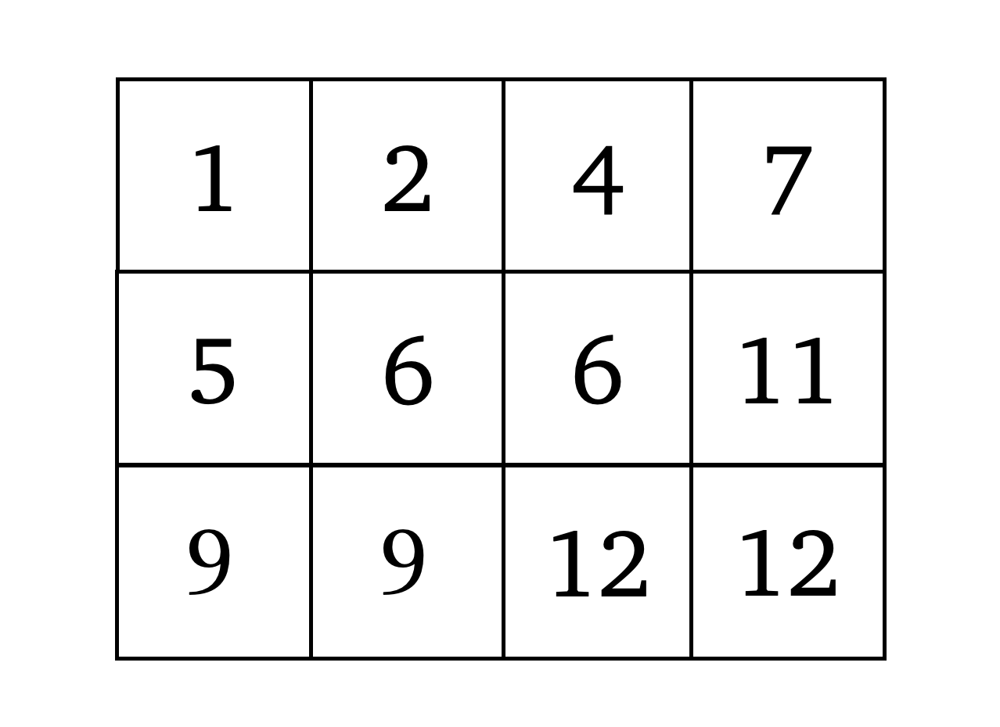
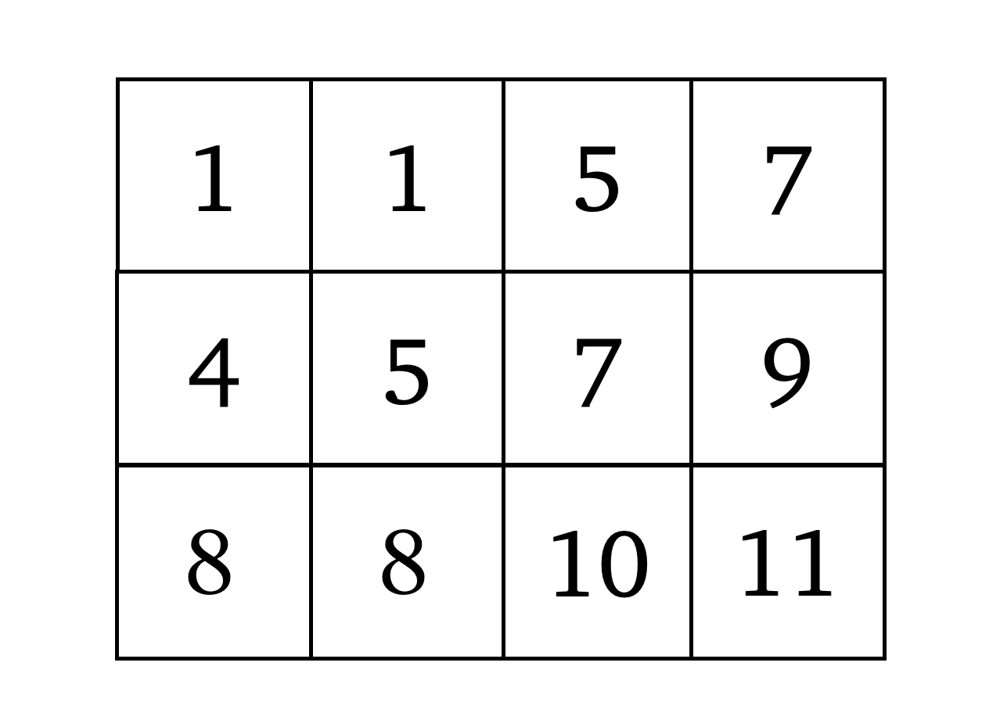
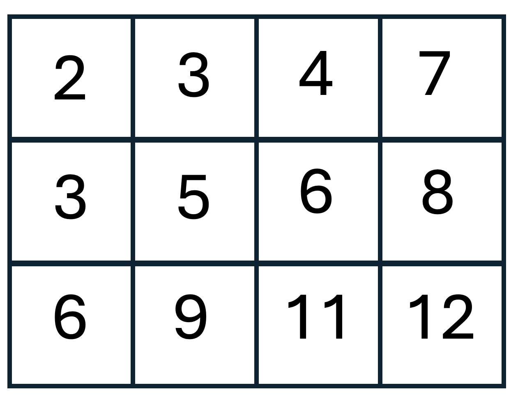

# Grassmannian Cluster Algebras and Semistandard Young Tableau (open problem)

The Grassmann manifold $\text{Gr}(k,n)$ is the set of full-rank $k \times n$ matrices up to equivalence of elementary row operations (equivalently the space whose points are $k$-dimensional subspaces in $\mathbb{R}^n$). Grassmannians are of fundamental geometric importance and are a central tool in a model of quantum field theory known as supersymmetric Yang-Mills theory. 

Among the many algebraic-combinatorial properties of Grassmannians is an algebraic structure on its coordinate ring making it into an algebraic object called a cluster algebra. A recent result of [Chang, Duan, Fraser, and Li \[1\]](https://arxiv.org/abs/1907.13575) parameterize cluster variables of the Grassmannian coordinate ring in terms of equivalence classes of semistandard Young tableaux (SSTY). Not every SSTY indexes a cluster variable and a natural question to ask is whether there is a naive combinatorial rule that specifies whether a particular SSTY indexes a cluster variable. One necessary condition is that the tableaux is of rectangular shape. 

The idea to apply machine learning to this problem was first posed by [\[2\]](https://arxiv.org/abs/2212.09771). We follow their set up and use the positive examples that they computed (i.e., SSTY that index a cluster variable). However, we choose a different method of sampling tableau that do not index cluster variables that we found makes the problem harder (and therefore forces the model to learn more robust features).

## Details and an example

In the cluster algebra associated with Grassmann manifold $\text{Gr}(k,n)$, each cluster variable variable is indexed by a rectangular SSYT with $k$ rows with entries drawn from $\{1,\dots,n\}$ (because this is a SSYT, the entries need to weakly increase as one moves left to right in the rows and strictly increase as one moves down each column). The *rank* of these rectangular SSTY (and the rank of the associated cluster algebras) is given by their number of columns. Following [\[2\]](https://arxiv.org/abs/2212.09771), in this dataset we focus on $\text{Gr}(3,12)$ and hence look at rectangular SSTY with 4 rows filled with entries drawn from $\{1,\dots,12\}$. We further restrict to rank 4 SSYT. This leaves us with a collection of $3 \times 4$ arrays whose entries increase weakly across rows and strictly down columns. 

To give two examples, the SSYT below corresponds to a cluster variable

 
but this one does not

Note that both are genuine SSYT of shape $3 \times 4$ with entries from $\{1, \dots, 12\}$.

## Dataset

The dataset consists of a collection of rectangular SSYT each with a label indicating whether it indexs a cluster variable or not. Those that do not index a cluster variable are labeled with a `0` and those that do are labeled with a `1`. The dataset we provide consists of tableau of shape $3 \times 4$, filled with values from $1,2,\dots,12$. The files we provide are: 
- ``3_4_12_invalid_train.txt``
- ``3_4_12_invalid_test.txt``
and can be found [here](https://drive.google.com/file/d/1Dd4PAOgm7bAtXSGmQW81OE-O_7dS7qU_/view?usp=sharing).

These contain tableau that do not correspond to cluster variables, 'invalid examples'. Files containing the valid examples were computed by others in [\[2\]](https://arxiv.org/abs/2212.09771) and can be obtained at [https://github.com/edhirst/GrassmanniansML](https://github.com/edhirst/GrassmanniansML).  In this directory we provide code to generate the full splits from the data obtained from these two sources.

We use braces $[$ and $]$ to demarcate rows of the dataset, so that

``[[2, 3, 4, 7], [3, 5, 6, 8], [4, 9, 11, 12]]``

corresponds to the tableau pictured in the Figure below

Dataset statistics are as follows

|  | SSYT indexes a cluster variable | SSYT does not index a cluster variable | Total number of instances | 
|----------|----------|----------|----------|
| Train | 74,329 | 74,329 | 148,658 |
| Test  | 18,582 | 18,582 | 37,164 |

## Task

The immediate machine learning task consists of predicting whether a SSYT indexes a cluster variable or not. The hope is that a performant model will have learned simple features that may lead to a concise characterization of those SSYT that index cluster variables. 

## Data generation

The positive sampled for this dataset were generated for the paper [\[2\]](https://arxiv.org/abs/2212.09771). The code for this can be found at [https://github.com/edhirst/GrassmanniansML](https://github.com/edhirst/GrassmanniansML). 

## Small model performance

| Architecture  | Accuracy | 
|----------|----------|
| Logistic regression |  | 
| MLP |  | 
| Transformer |  | 

\[1\] Chang, Wen, et al. "Quantum affine algebras and Grassmannians." Mathematische Zeitschrift 296.3 (2020): 1539-1583.

\[2\] Cheung, Man-Wai, et al. "Clustering cluster algebras with clusters." arXiv preprint arXiv:2212.09771 (2022).

