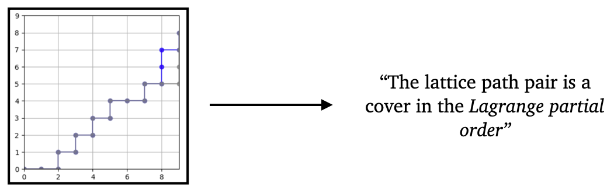
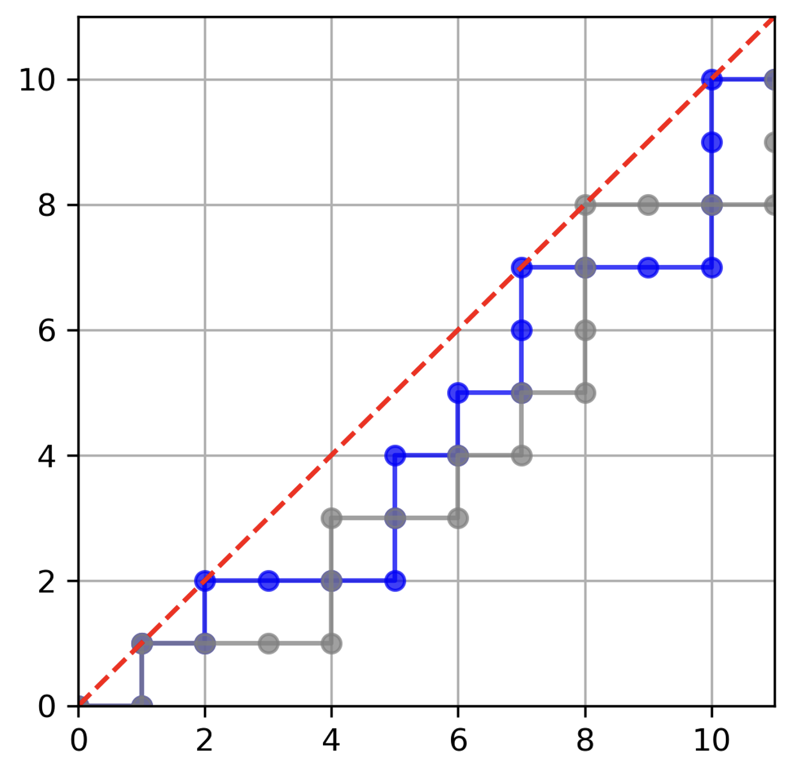
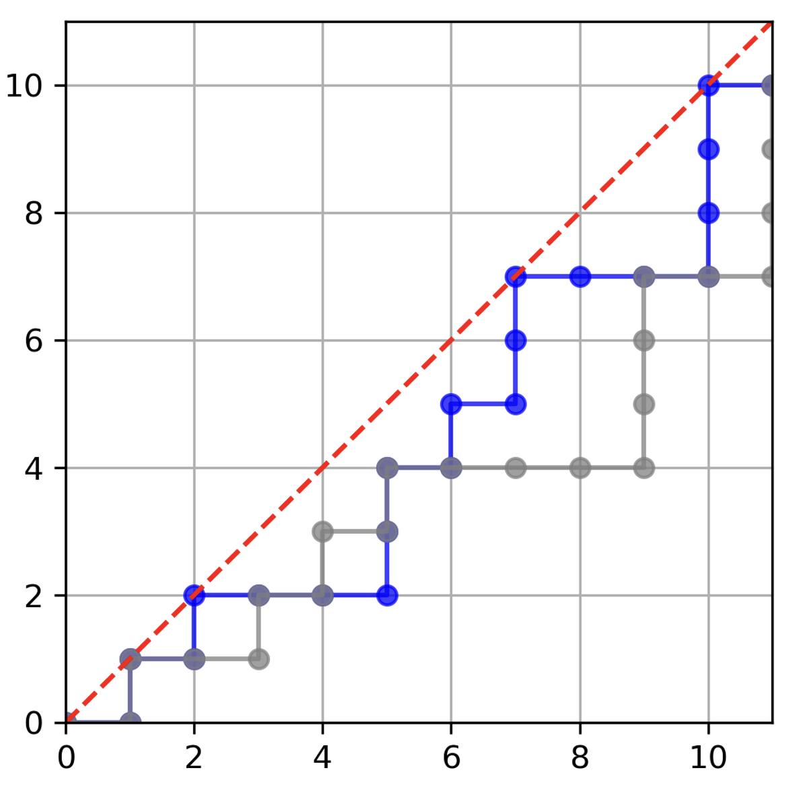

# Partial Orders on Lattice Paths (Open Problem)



NE lattice paths from $(0, 0)$ to $(a, b)$ are paths starting at $(0,0)$ and ending at $(a,b)$ which consist of a sequence of single unit steps either north or east  that never pass below the diagonal (see example below). These turn out to have deep connections to a number of topics in algebra, geometry, and number theory. In \[1\], Schiffler defines two order relations on such paths called *matching ordering* ($\leq_M$) and *Lagrange ordering* ($\leq_L$) that are motivated by constructions in the algebraic theory of cluster algebras and number theory. Matching ordering assigns a number to each lattice path based on the number of perfect matchings of an associated snake graph, while the Lagrange ordering assigns a number to each lattice path equal to the Lagrange number of a continued fraction. These numbers each define their respective partial order. In many ways, these orders are still poorly understood. 

## Details and an example

We provide two different pairs of lattice paths below. The example on the left is a cover pair in Lagrange order. The example on the right is a covering pair in matching order. 

 

## Dataset

Lattice paths from $(0,0)$ to $(n+1,n)$ are encoded by a sequence of $1$'s (for steps east) and $0$'s (for steps north) of length $(n+1) + n = 2n+1$. Each pair of lattice paths is a covering pair in exactly one of the two partial orders, the Lagrange order or the matching order. Covering pairs for both orders were few and were thrown out.

Each instance in the dataset contains two lattice paths, 'Lattice path 1' and 'Lattice path 2' which form a covering relation (lattice path 2 covers lattice path 1). A label of `0` corresponding to matching order and a label of `1` corresponds to Lagrange order.

We provide datasets for $n = 10 \times 9, 11 \times 10, 12 \times 11$.
- [10 x 9](https://huggingface.co/datasets/ACDRepo/partial_orders_on_lattice_paths_10x9)
- [11 x 10](https://huggingface.co/datasets/ACDRepo/partial_orders_on_lattice_paths_11x10)
- [12 x 11](https://huggingface.co/datasets/ACDRepo/partial_orders_on_lattice_paths_12x11)

This data can be easily downloaded and used via transformers datasets. 

```
from datasets import load_dataset

# Login using e.g. `huggingface-cli login` to access this dataset
ds = load_dataset(DATASET_NAME)
```
In the code snippet above, just replace `DATASET_NAME` with one of the following:
- `'ACDRepo/partial_orders_on_lattice_paths_10x9'`
- `'ACDRepo/partial_orders_on_lattice_paths_11x10'`
- `'ACDRepo/partial_orders_on_lattice_paths_12x11'`

### Lattice paths from $(0,0)$ to $(10,9)$ 

|  | Lagrange | Matching | Total number of instances | 
|----------|----------|----------|----------|
| Train | 7,589 | 3,875 | 11,433 |
| Test  | 1,895 | 968 | 2,863 | 

### Lattice paths from $(0,0)$ to $(11,10)$ 

|  | Lagrange | Matching | Total number of instances | 
|----------|----------|----------|----------|
| Train | 26,427 | 13,424 | 39,851 |
| Test  | 6,601 | 3,355 | 9,956 | 

### Lattice paths from $(0,0)$ to $(12,11)$ 

|  | Lagrange | Matching | Total number of instances | 
|----------|----------|----------|----------|
| Train | 93,218 | 46,976 | 140,194 |
| Test  | 23,324 | 11,749 | 35,073 | 

### Lattice paths from $(0,0)$ to $(13,12)$ 

|  | Lagrange | Matching | Total number of instances | 
|----------|----------|----------|----------|
| Train | 331,065 | 166,304 | 497,369 |
| Test  | 82,789 | 41,580 | 124,369 | 

## Data Generation

Datasets were generated using SageMath. A SageMath notebook with the code to do this can be found in this repository \[3\].

## Task

**Math question:** As stated in [\[1\]](https://arxiv.org/abs/2302.02185), the problem is to "Study the posets $\mathcal{D}(a,b)$ … with respect to $\leq_L$ and $\leq_M$." Where $\mathcal{D}(a,b)$ is the set of all NE lattice paths from $(0,0)$ to $(a,b)$ that never pass above the diagonal and with $a,b$ relatively prime. 

**ML task:** Recall that $x$ covers $y$ in a partial order if $y < x$ and there is no $z$ such that $y < z < x$. Given a pair of lattice paths $(w,w')$, train a model that can predict whether $w'$ covers $w$ in either matching or Lagrange order (cases where $w'$ covers $w$ in both orders are few and have been excluded). 

Note that the ML task is far more specific than the math question. The idea is that a model that can effectively identify covers, has probably extracted useful features from lattice paths that carry interesting information about the partial orders $\leq_L$ and $\leq_M$.

## Small model performance

| Size | Logistic regression | MLP | Transformer | TODO | 
|----------|----------|-----------|------------|------------|
| $n= 10$ | $66.2\\%$ | $90.6\\% \pm 0.8\\%$ | $65.3\\% \pm 0.0\\%$| $0.0\\%$ |
| $n= 11$ | $66.3\\%$ | $95.8\\% \pm 0.3\\%$ | $69.4\\% \pm 6.0\\%$| $0.0\\%$ |
| $n= 12$ | $66.5\\%$ | $98.6\\% \pm 0.1\\%$ | $86.2\\% \pm 14.2\\%$| $0.0\\%$ |

The $\pm$ signs indicate 95% confidence intervals from random weight initialization and training.

## References

\[1\] Schiffler, Ralf. "Perfect matching problems in cluster algebras and number theory." arXiv preprint arXiv:2302.02185 (2023).

\[2\] Apruzzese, P. J., and Kevin Cong. "On Two Orderings of Lattice Paths." arXiv preprint arXiv:2310.16963 (2023).

\[3\] Stein, William. "Sage: Open source mathematical software." (2008).
