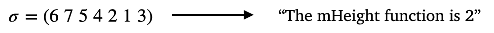

# The mHeight Function of a Permutation



Truly challenging open problems in mathematics often require the development of new mathematical constructions (or even entire new areas of mathematics). This dataset represents a modest example of this. The mHeight function is a statistic associated with a permutation that relates to all $3412$-patterns in the permutation. It was developed and plays a crucial role in the proof by Gaetz and Gao \[1\] which resolved a long-standing conjecture of Billey and Postnikov \[2\] about the coefficients on Kazhdan-Lusztig polynomials (see our [Kazhdan-Lusztig polynomial dataset](https://github.com/pnnl/ML4AlgComb/tree/master/kl-polynomial_coefficients)) which carry important geometric information about certain spaces, Schubert varieties, that are of interest both to mathematicians and physicists. The task of predicting the mHeight function represents an interesting opportunity to understand whether a non-trivial intermediate step in an important proof can be learned by machine learning. 

Let $\sigma  = a_1 \ldots a_n \in S_n$ be a permutation containing at least one occurrence of a $3412$ pattern. Let $(a_i,a_j,a_k,a_\ell)$ be a $3412$ pattern so that $1 \leq i < j < k < \ell \leq n$ but $a_k < a_\ell < a_i < a_j$. The *height* of $(a_i,a_j,a_k,a_\ell)$ is $a_i - a_\ell$. The *mHeight* of $\sigma$ is then the minimum height over all $3412$ patterns in $\sigma$. 

## An Example

 

## Dataset 

This dataset contains permutations labeled by their mHeight. Each instance is a permutation written in 1-line notation and
its mHeight. We provide datasets for $n = 8,9,10$.
- [n = 8](https://huggingface.co/datasets/ACDRepo/mheight_function_8)
- [n = 9](https://huggingface.co/datasets/ACDRepo/mheight_function_9)
- [n = 10](https://huggingface.co/datasets/ACDRepo/mheight_function_10)

This data can be easily downloaded and used via transformers datasets. 

```
from datasets import load_dataset

# Login using e.g. `huggingface-cli login` to access this dataset
ds = load_dataset(DATASET_NAME)
```
In the code snippet above, just replace `DATASET_NAME` with one of the following:
- `'ACDRepo/mheight_function_8'`
- `'ACDRepo/mheight_function_9'`
- `'ACDRepo/mheight_function_10'`

### Permutations of size $8$

For $n = 8$, mHeight takes values 0, 1, 2, 3, 4. 

| mHeight value  | 0 | 1 | 2 | 3 | 4 |   Total number of instances | 
|----------|----------|----------|----------|----------|----------|----------|
| Train | 6,716 | 508 | 78 | 9 | 1 | 7,312 |
| Test  | 1,672 | 136 | 18 | 3 | 0 | 1,829 |

### Permutations of size $9$

For $n = 9$, mHeight takes values 0, 1, 2, 3, 4, 5. 

| mHeight value  | 0 | 1 | 2 | 3 | 4 | 5 |  Total number of instances | 
|----------|----------|----------|----------|----------|----------|----------|----------|
| Train | 49,092 | 3,161 | 524 | 77 | 9 | 1 | 52,864 |
| Test  | 12,317 | 759 | 118 | 19 | 3 | 0 | 13,216 |

### Permutations of size $10$

For $n = 10$, mHeight takes values 0, 1, 2, 3, 4, 5, 6. 

| mHeight value  | 0 | 1 | 2 | 3 | 4 | 5 | 6 | Total number of instances | 
|----------|----------|----------|----------|----------|----------|----------|----------|----------|
| Train | 352,494 | 17,952 | 3,079 | 502 | 74 | 10 | 1 | 374,112 |
| Test  | 88,058 |  4,503 | 803 | 140 | 22 | 2 | 0 | 93,528 |

## Data Generation

The datasets were generated using a Python script which can be found above.

## Task

**ML task:** Given a permutation, predict the mHeight. Since for small permutations mHeight can only take a limited number of values (for instance it is easy to see that it must be less that $n$ for permutations of $n$ elements), we frame this as a classification problem.

## Small model performance

| Size | Logistic regression | MLP | Transformer | Guessing 0 | 
|----------|----------|-----------|------------|------------|
| $n= 8$ | $91.4\\%$ | $99.4\\% \pm 0.3\\%$ | $99.7\\% \pm 0.4\\%$| $91.4\%$ |
| $n= 9$ | $93.2\\%$ | $99.8\\% \pm 0.6\\%$ | $99.9\\% \pm 0.4\\%$| $93.2\%$ |
| $n= 10$ | $94.2\\%$ | $99.9\\% \pm 0.0\\%$ | $99.9\\% \pm 0.6\\%$| $94.2\%$ |

The $\pm$ signs indicate 95% confidence intervals from random weight initialization and training.

## References

\[1\] Gaetz, Christian, and Yibo Gao. "On the minimal power of $q$ in a Kazhdan-Lusztig polynomial." arXiv preprint arXiv:2303.13695 (2023).

\[2\] Billey, Sara, and Alexander Postnikov. "Smoothness of Schubert varieties via patterns in root subsystems." Advances in Applied Mathematics 34.3 (2005): 447-466.
