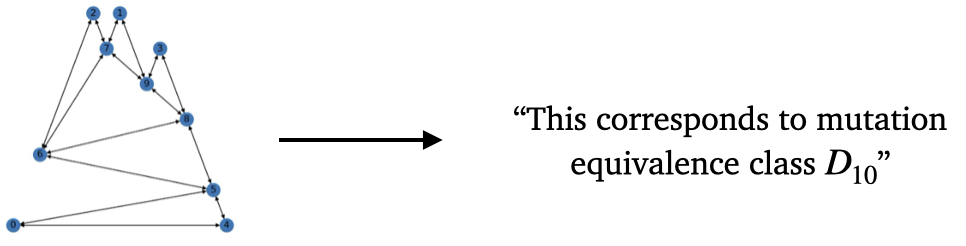

# Mutation Equivalence of Quivers (Open Problem)



Quivers and quiver mutations are central to the combinatorial study of cluster algebras, algebraic structures with connections to Poisson Geometry, string theory, and Teichmuller theory. Quivers are directed (multi)graphs, and a quiver mutation is a local transformation centered at a chosen node of the graph that involves adding, deleting, and reversing the orientation of specific edges based on a set of combinatorial rules. A fundamental open problem in this area is finding an algorithm that determines whether two quivers are mutation equivalent (one can traverse from one quiver to another by applying mutations). Currently, such algorithms only exist for special cases (including types $A$ \[1\], $D$ \[2\], and $\tilde{D}$ \[3\]). To our knowledge, the remaining classes in this dataset ($E$, $DE$, $BE$, and $B$) lack characterizations. Recent work has explored whether deep learning models can learn to correctly predict if two quivers are mutation equivalent \[4\]. \[5\] utilized a subset of this dataset to re-discover known characterization theorems. 

## Dataset 

The task associated with this dataset involves identifying whether two quivers are mutation equivalent. Thus, the inputs are quivers (directed multigraphs) with $11$ nodes that are encoded by their $11 \times 11$ adjacency matrices and the labels are one of $7$ different equivalence classes: $A_{11},BB_{11},BD_{11},BE_{11},D_{11},DE_{11},E_{11}$. The files are organized by train and test for each of these classes. For the quiver mutation classes that are not mutation finite (that is, the mutation equivalence class has an infinite number of elements), the datasets contain quivers generated up to a certain depth, which is the distance from the original quiver, measured by number of mutations. The depth is specified in the table below and was chosen to achieve as close to a balanced dataset as possible. 

This data can be easily downloaded and used via transformers datasets. 

```
from datasets import load_dataset

# Login using e.g. `huggingface-cli login` to access this dataset
ds = load_dataset("ACDRepo/quiver_mutation_equivalence")
```

| Mutation equivalance class | Sampling depth |
|---|---|
| \\(B_{11}\\) | 10 |
| \\(BD_{11}\\) | 9 |
| \\(BE_{11}\\) | 8 |
| \\(DE_{11}\\) | 9 |
| \\(E_{11}\\) | 9 |

Datasets can be found [here](https://drive.google.com/file/d/1UmRLOhNq2mX6s4NQPIgciuGG9HfvrKWC/view?usp=sharing)

Dataset statistics are as follows:

| | $A_{11}$ | $B_{11}$ | $BD_{11}$ | $BE_{11}$ | $D_{11}$ | $DE_{11}$ | $E_{11}$ | Total |
|---|---|--|---|---|---|----|----|---|
| Training | 11,940 | 27,410 | 23,651 | 22,615 | 25,653 | 23,528 | 28,998 | 163,795 |
| Test | 2,984 | 6,852 | 5,912 | 5,653 | 6,413 | 5,881 | 7,249 | 40,944 |


## Data generation

All mutation classes were generated using Sage \[6\], and the script we used to generate the data is available above.

## Task

**Math question:** Find simple rules to determine whether or not a quiver belongs to a specific mutation equivalence class (out of classes $A_{11},BB_{11},BD_{11},BE_{11},D_{11},DE_{11},E_{11}$).

**ML task:** Train a model that can predict a quiver's mutation equivalence class out of the 7 options above.

See the work [\[2\]](https://arxiv.org/abs/2411.07467) for an example of how a model trained on a variant of this dataset was used to re-discover known theorems.

## Small model performance

|  | Accuracy | 
|----------|----------|
| Logistic regression | $40.3\%$ |
| MLP | $86.5\% \pm 1.9\%$ | 
| Transformer | $92.9\% \pm 0.5\%$ |
| Guessing largest class | $17.7\%$ |

The $\pm$ signs indicate 95% confidence intervals from random weight initialization and training.

\[1\] Buan, Aslak Bakke, and Dagfinn F. Vatne. "Derived equivalence classification for cluster-tilted algebras of type $A_n$." Journal of Algebra 319.7 (2008): 2723-2738.

\[2\] Vatne, Dagfinn F. "The mutation class of $D_n$ quivers." Communications in Algebra 38.3 (2010): 1137-1146.

\[3\] Henrich, Thilo. "Mutation classes of diagrams via infinite graphs." Mathematische Nachrichten 284.17‐18 (2011): 2184-2205.

\[4\] Bao, Jiakang, et al. "Machine learning algebraic geometry for physics." arXiv preprint arXiv:2204.10334 (2022).

\[5\] He, Jesse, et al. "Machines and Mathematical Mutations: Using GNNs to Characterize Quiver Mutation Classes." arXiv preprint arXiv:2411.07467 (2024).

\[6\] Stein, William. "Sage: Open source mathematical software." (2008).

