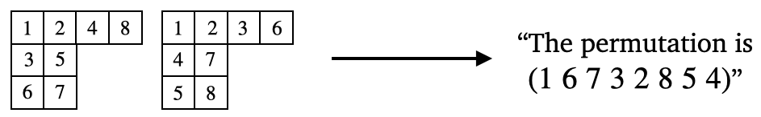

# The Robinson-Schensted-Knuth Correspondence (Foundational Result)

The Robinson-Schensted-Knuth (RSK) algorithm \[1,2\] gives a bijection between pairs of semistandard Young tableau of the same shape and matrices with non-negative integer entries. The special case we consider (which is sometimes called the Robinson-Schensted algorithm) restricts to a bijection between pairs of standard Young tableaux and permutations in $S_n$. This correspondence is significant in algebraic combinatorics because it connects two of the most fundamental objects in the field, permutations and standard Young tableaux (see \cite{stanley-1984} for additional history and context). 

The goal of this benchmark is to see whether a model can learn the RSK algorithm. That is, for a fixed $n$ the model is provided with a permutation $\pi \in S_n$ and required to predict pairs of standard Young tableaux. Although the algorithm is known, it would be significant for a model to learn this correspondence due to the the intricate combinatorial rules involved. Notably, the RSK correspondence can be used to find the length of the longest increasing subsequence, so a model that learns this algorithm implicitly must also learn to solve the increasing subsequence problem. Additionally, given the numerous generalizations of the RSK correspondence, a model that performs well on this benchmark could potentially be investigated for its ability to generalize to other related combinatorial settings. 

## Dataset 

The dataset consists of triples: two standard Young tableau of size $n$ and their corresponding permutation (obtained via the RSK algorithm). We include datasets for $n = 8,9,10$. 

Unlike some of the other datasets where permutations are written in one-line notation, in this dataset we write them in terms of their inversion set. For a permutation $\sigma$ on $n$ elements, the inversion set gives all pairs of numbers $1 \leq i < j \leq n$ such that $\sigma(j) < \sigma(i)$. There are $\binom{n}{2}$ possible inversions for $\sigma$. We represent the inversion set as a binary code where $1$ means that $\sigma$ inverts $(i, j)$ and $0$ means that it does not. Note that an inversion set completely characterizes a permutation.

The entries of the inversion vector are written in lexicographical order. The lexicographical order on transpositions of the set $\{1, 2, 3\}$ ($n=3$) is $(1,2)$, $(1,3)$, $(2,3)$. Since the permutation $213$ inverts $(1, 2)$ but not $(1, 3)$ or $(2, 3)$, its binary code would be written as ``1, 0, 0``.

The datasets can be downloaded [here](https://drive.google.com/file/d/1CfuxD_XgTefbEduxJnXgXoUOt-GY-smq/view?usp=sharing). 

## Data generation

This dataset was generated with Sage \[3\]. Code can be found above.

## Task

**ML task:** Given a pair of standard Young tableaux, predict the corresponding permutation obtained via the RSK algorithm. As noted above, output permutations are represented as a $\{0,1\}$-vector corresponding to their inversion set.

While the RSK algorithm is simple enough to be taught to a grade school student, it may involve many steps for larger $n$. This may be the ultimate reason this is a hard problem for ML algorithms.

## Small model performance

| Size | Logistic regression | MLP | Transformer | Guessing target mean | 
|----------|----------|-----------|------------|------------|
| $n= 8$ | $0.21$ | $0.43 \pm 0.05$ | $1.51 \pm 0.02$| $0.21$ |
| $n= 9$ | $0.21$ | $0.96 \pm 0.07$ | $3.85 \pm 0.09$| $0.21$ |

The $\pm$ signs indicate 95% confidence intervals from random weight initialization and training.

## References

\[1\] Robinson, G. de B. "On the representations of the symmetric group." American Journal of Mathematics (1938): 745-760.

\[2\] Schensted, Craige. "Longest increasing and decreasing subsequences." Canadian Journal of mathematics 13 (1961): 179-191.

\[3\] Stein, William. "Sage: Open source mathematical software." (2008).
