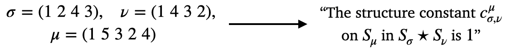

# A Combinatorial Interpretation of Schubert Polynomial Structure Constants (Open Problem)

Schubert polynomials \[1,2,3\] are a family of polynomials indexed by permutations of $S_n$. Developed to study the cohomology ring of the flag variety, they have deep connections to algebraic geometry, Lie theory, and representation theory. Despite their geometric origins, Schubert polynomials can be described combinatorially \[4,5\], making them a well-studied object in algebraic combinatorics. An important open problem in the study of Schubert polynomials is understanding their *structure constants*. 

When two Schubert polynomials $\mathfrak{S}\_{\alpha}$ and $\mathfrak{S}\_{\beta}$ (indexed by permutations $\alpha \in S_n$ and $\beta \in S_m$) are multiplied, their product can be written as a linear combination of Schubert polynomials
$\mathfrak{S}\_{\alpha} \mathfrak{S}\_{\beta} = \sum\_{\gamma} c^{\gamma}\_{\alpha \beta} \mathfrak{S}\_{\gamma}$. Where the sum runs over permutations in $S_{n+m}$.
The question is whether the $c^{\gamma}\_{\alpha \beta}$ (the *structure constants*) have a combinatorial interpretation. To give an example of what we mean by combinatorial interpretation, when Schur polynomials (which can be viewed as a specific case of Schubert polynomials) are multiplied together, the coefficients in the resulting product are equal to the number of semistandard tableaux satisfying certain properties.

## Example

We multiply Schubert polynomials corresponding to permutations of $\\{1,2,3\\}$, $\alpha = 2 1 3$ and $\beta = 1 3 2$. Writing these in terms of indeterminants $x_1$, $x_2$, and $x_3$, we have $\mathfrak{S}\_{\alpha} = x_1 + x_2$ and $\mathfrak{S}\_{\beta} = x_1$. Multiplying these together we get
$\mathfrak{S}_{\alpha}\mathfrak{S}\_{\beta} = x_1^2 + x_1x_2$. As $\mathfrak{S}\_{2 3 1} = x\_1x\_2$ and $\mathfrak{S}\_{3 1 2} = x\_1^2$ we can write $\mathfrak{S}\_{\alpha}\mathfrak{S}\_{\beta} = \mathfrak{S}\_{2 3 1} + \mathfrak{S}\_{3 1 2}$. It follows that $c\_{\alpha,\beta}^{\gamma} = 1$ if $\gamma = 2 3 1$ or $\gamma = 3 1 2$ and otherwise $c\_{\alpha,\beta}^{\gamma} = 0$.

## Dataset 
Each instance in this dataset is a triple of permutations $(\alpha,\beta,\gamma)$, 
labeled by its coefficient $c^{\gamma}\_{\alpha \beta}$ in the expansion of the product 
$\mathfrak{S}\_{\alpha} \mathfrak{S}\_{\beta}$. We call permutations $\alpha$ and $\beta$
*lower index permutations 1* and *2* respectively. We call $\gamma$ the *upper index 
permutation*. The datasets are organized so that 
$\alpha$ and $\beta$ are always drawn from the symmetric group on $n$ elements 
(we provide datasets for $n = 3$, $4$, and $5$), but $\gamma$ may belong to a 
strictly larger symmetric group. Not all possible triples of permutations are included 
since the vast majority of these would be zero. The dataset consists of an approximately 
equal number of zero and nonzero coefficients (but they are not balanced between quantities 
of non-zero coefficients). 

The basic statistics of the datasets are as follows

### Permutations of size $4$

All structure constants in this case are either 0 or 1 (so the classification problem is binary). 

|  | 0 | 1 | Total number of instances | 
|----------|----------|----------|----------|
| Train | 851 | 833 | 1,684 |
| Test  | 201 | 220 | 421 |

### Permutations of size $5$

All structure constants in this case are either 0, 1, or 2. 

|  | 0 | 1 | 2 |  Total number of instances | 
|----------|----------|----------|----------|----------|
| Train | 42,831 | 42,619 | 170 | 85,620 |
| Test  | 10,681 | 10,680 | 44 | 21,405 |

### Permutations of size $6$

All structure constants in this case are either 0, 1, 2, 3, 4, or 5. 

|  | 0 | 1 | 2 | 3 | 4 | 5 |  Total number of instances | 
|----------|----------|----------|----------|----------|----------|----------|----------|
| Train | 4,202,040 | 4,093,033 | 109,217 | 2,262 | 9 | 9 | 8,406,564 |
| Test  | 1,052,062 | 1,021,898 | 27,110 | 568 | 3 | 0 | 2,101,641 |

## Data generation

The Sage notebook within this directory gives the code used to generate these datasets. The process involves:

- For a chosen $n$, compute the products $\mathfrak{S}\_{\alpha} \mathfrak{S}\_{\beta}$ for $\alpha,\beta \in S_n$.
- For each of these pairs, extract and add to the dataset all non-zero structure constants $c^{\gamma_1}\_{\alpha,\beta}, \dots, c^{\gamma_k}\_{\alpha,\beeta}$
- Furthermore, for each $c^{\gamma_i}\_{\alpha,\beta} \neq 0$, randomly permute $\gamma_i \mapsto \gamma_i'$ to find $c^{\gamma_i'}\_{\alpha,\beta} = 0$ and $c^{\gamma_i'}\_{\alpha,\beta}$ is not already in the dataset.

## Task 

**Math question:** Develop a better understanding of the structure constants of Schubert polynomials paying special attention to combinatorial interpretations by focusing on the triples of permutations that index them.

**ML task:** Train a model that, given three permutations $\alpha, \beta, \gamma$, can predict the associated structure constant $c^{\gamma}\_{\alpha,\beta}$.

## Small model performance

| Size | Logistic regression | MLP | Transformer | Guessing majority class | 
|----------|----------|-----------|------------|------------|
| $n= 4$ | $88.8\\%$ | $93.1\\% \pm 2.6\\%$ | $94.6\\% \pm 1.0\\%$| $52.3\\%$ |
| $n= 5$ | $90.6\\%$ | $97.5\\% \pm 0.2\\%$ | $96.2\\% \pm 1.1\\%$| $49.9\\%$ |
| $n= 6$ | $89.7\\%$ | $99.8\\% \pm 0.0\\%$ | $91.3\\% \pm 8.0\\%$| $50.1\\%$ |

The $\pm$ signs indicate 95% confidence intervals from random weight initialization and training.

## References

\[1\] Bernstein, IMGI N., Israel M. Gel'fand, and Sergei I. Gel'fand. "Schubert cells and cohomology of the spaces G/P." Russian Mathematical Surveys 28.3 (1973): 1.

\[2\] Demazure, Michel. "Désingularisation des variétés de Schubert généralisées." Annales scientifiques de l'École Normale Supérieure. Vol. 7. No. 1. 1974.

\[3\] Lascoux, Alain, and Marcel-Paul Schützenberger. "Structure de Hopf de l’anneau de cohomologie et de l’anneau de Grothendieck d’une variété de drapeaux." CR Acad. Sci. Paris Sér. I Math 295.11 (1982): 629-633.

\[4\] Billey, Sara C., William Jockusch, and Richard P. Stanley. "Some combinatorial properties of Schubert polynomials." Journal of Algebraic Combinatorics 2.4 (1993): 345-374.

\[5\] Bergeron, Nantel, and Sara Billey. "RC-graphs and Schubert polynomials." Experimental Mathematics 2.4 (1993): 257-269.
