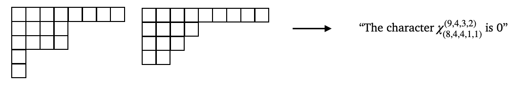

# Combinatorial Algorithms to Calculate the Characters of Irreducible Representations of the Symmetric Group (Foundational Result)



One way to understand the algebraic structure of permutations (symmetric groups, $S\_n$) is through their representation theory \[1\], which converts algebraic questions into linear algebra questions that are often easier to solve. 
A *representation* of group $G$ on vector space $V$, is a map $\phi:G \rightarrow GL(V)$ that converts elements of $g$ to invertible matrices on vector space $V$ which respect the compositional structure of the group. A basic result in representation theory says that all representations of a finite group can be decomposed into atomic building blocks called *irreducible representations*. Amazingly, irreducible representations are themselves uniquely determined by the value of the trace, $\text{Tr}(\phi(g))$, where $g$ ranges over subsets of $G$ called conjugacy classes. These values are called *characters*. 

The representation theory of symmetric groups has rich combinatorial interpretations. Both irreducible representations of $S\_n$ and the conjugacy classes of $S\_n$ are indexed by partitions of $n$ and thus the characters of irreducible representations of $S\_n$ are indexed by pairs of partitions of $n$. For $\lambda,\mu \vdash n$ we write $\chi^\lambda\_\mu$ for the associated character. This combinatorial connection is not superficial, some of the most famous algorithms for computation of irreducible characters (e.g., the [Murnaghan-Nakayama rule](https://en.wikipedia.org/wiki/Murnaghan–Nakayama_rule)) are completely combinatorial in nature).

## Dataset 
Each instance of the dataset consists of two integer partitions of $22$ (one 
corresponding to the irreducible
representation and one corresponding to the conjugacy class) and the
corresponding character (which is always an integer). For a small $n = 5$ example, 
if the first partition is `[3,1,1]`, the second partition is `[2,2,1]`, and the character
is `-2`, then this says that the character $\chi^{3,1,1}_{2,2,1} = −2$. 

In all cases the characters are heavily concentrated around 0 with very long tails. 
This likely contributes to the difficulty of the task and could be overcome with some 
simple pre- and post-processing. We have not chosen to do this in our baselines.

We provide datasets for $n = 18,20,22$.
- [n = 18](https://huggingface.co/datasets/ACDRepo/symmetric_group_characters_18)
- [n = 20](https://huggingface.co/datasets/ACDRepo/symmetric_group_characters_20)
- [n = 22](https://huggingface.co/datasets/ACDRepo/symmetric_group_characters_22)

This data can be easily downloaded and used via transformers datasets. 

```
from datasets import load_dataset

# Login using e.g. `huggingface-cli login` to access this dataset
ds = load_dataset(DATASET_NAME)
```
In the code snippet above, just replace `DATASET_NAME` with one of the following:
- `'ACDRepo/symmetric_group_characters_18'`
- `'ACDRepo/symmetric_group_characters_20'`
- `'ACDRepo/symmetric_group_characters_22'`

### Characters of $S_{18}$

|  | Number of instances | 
|----------|----------|
| Train | 118,580 |
| Test  | 29,645 |

Maximum character value 16,336,320, minimum character value -1,223,040.


Histogram of $S_{18}$ characters within the interval $[-500,500]$.

### Characters of $S_{20}$

|  | Size | 
|----------|----------|
| Train | 298,661 |
| Test  | 74,819 |

Maximum character value 249,420,600, minimum character value -17,592,960.


Histogram of $S_{20}$ characters within the interval $[-500,500]$.

### Characters of $S_{22}$

|  | Size | 
|----------|----------|
| Train | 763,109 |
| Test  | 190,726 |

Maximum character value 5,462,865,408, minimum character value -279,734,796.


Histogram of $S_{22}$ characters within the interval $[-500,500]$.

## Task

**Math question (solved):** The [Murnaghan–Nakayama rule](https://en.wikipedia.org/wiki/Murnaghan–Nakayama_rule) is an example of an algorithm for calculating the character of an irreducible representation of the symmetric group using only elementary operations on the corresponding pair of partitions.

**ML task:** Train a model that can take two partitions of $n$, $\lambda$ and $\mu$, and predict the corresponding character $\chi^{\lambda}\_{\mu}$.

If a successful model is trained, it would be interesting to understand whether the model has learned an existing algorithm or whether it has discovered something new.

## Data generation

The data was generated using Sage \[2\]. The 

## Small model performance

| Size | Linear regression | MLP | Transformer | Guessing training label mean | 
|----------|----------|-----------|------------|------------|
| $n= 18$ | $1.5920 \times 10^{10}$ | $2.7447 \times 10^{8} \pm 8.8602 \times 10^8$ | $2.4913 \times 10^{10} \pm 1.4350 \times 10^7$| $1.5920 \times 10^{10}$ |
| $n= 20$ | $4.2007 \times 10^{12}$ | $4.2254 \times 10^{11} \pm 5.1236 \times 10^{11}$ | $5.3897 \times 10^{12} \pm 3.6464 \times 10^{11}$ | $4.2007 \times 10^{12}$ |
| $n= 22$ | $8.0395 \times 10^{14}$ | $1.1192 \times 10^{14} \pm 4.9321 \times 10^{12}$ | $1.3797 \times 10^{14} \pm 6.2799 \times 10^{12}$| $8.0395 \times 10^{14}$ |

The $\pm$ signs indicate 95% confidence intervals from random weight initialization and training.

## References

\[1\] Sagan, Bruce E. The symmetric group: representations, combinatorial algorithms, and symmetric functions. Vol. 203. Springer Science & Business Media, 2013.


