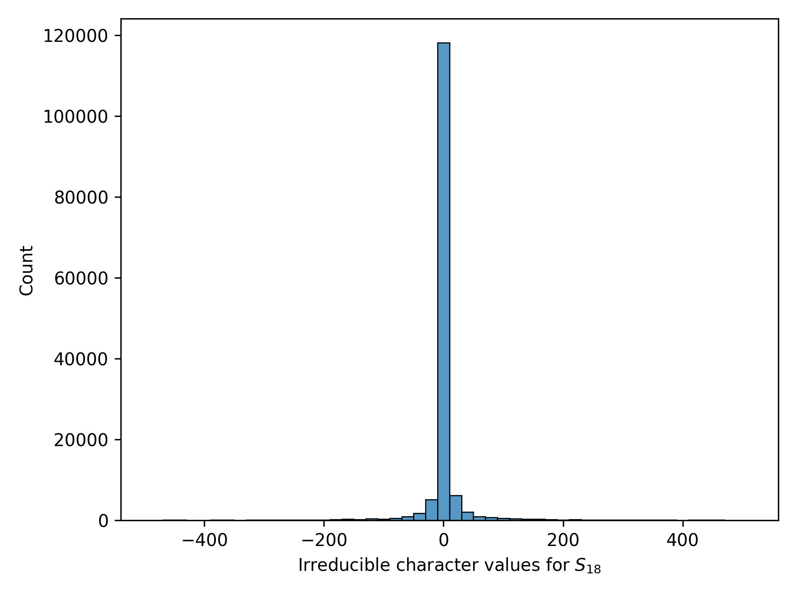
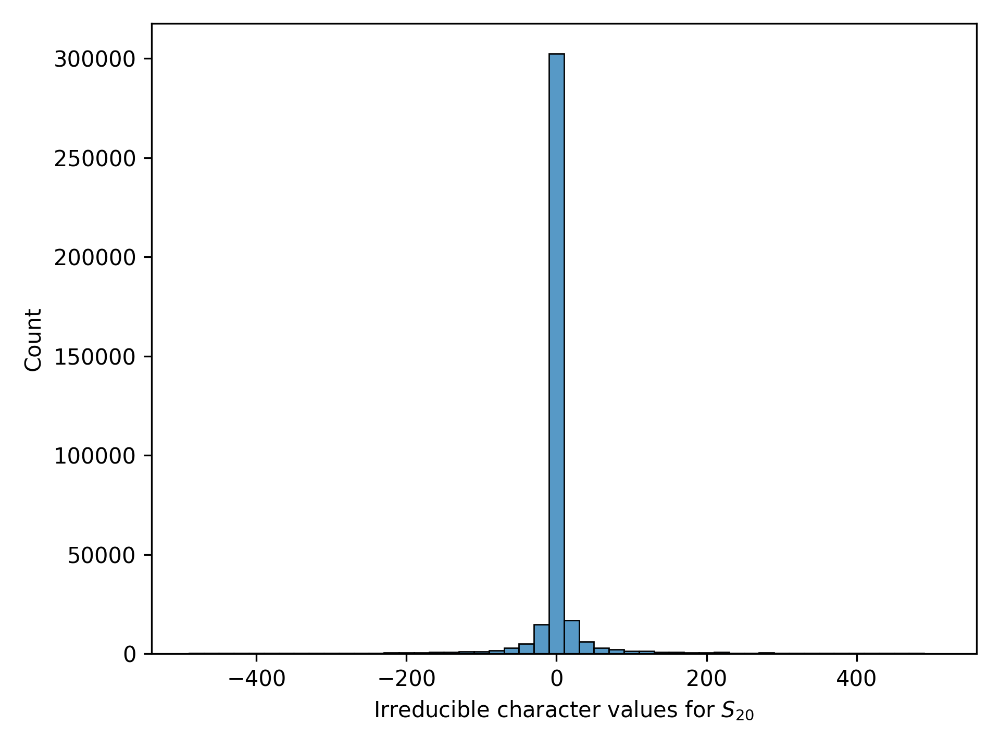
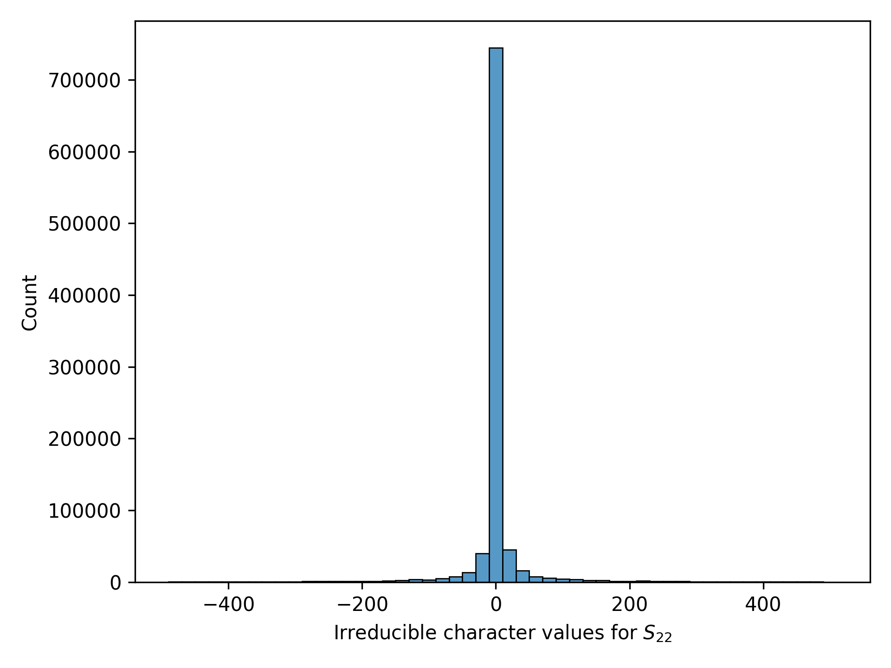

# Calculating the characters of irreducible representations of the symmetric group (classic result)

One way to understand the algebraic structure of permutations (symmetric groups, $S\_n$) is through their representation theory \[1\], which converts algebraic questions into linear algebra questions that are often easier to solve. 
A *representation* of group $G$ on vector space $V$, is a map $\phi:G \rightarrow GL(V)$ converts elements of $g$ to invertible matrices on vector space $V$ and which respects the compositional structure of the group. A basic result in representation theory says that all representations of a finite group can be decomposed into atomic building blocks called *irreducible representations*. Amazingly, irreducible representations are themselves uniquely determined by the value of the trace, $\text{Tr}(\phi(g))$, where $g$ ranges over subsets of $G$ called conjugacy classes. These value are called *characters*. 

The representation theory of symmetric groups has rich combinatorial interpretations. Both irreducible representations of $S\_n$ and the conjugacy classes of $S\_n$ are indexed by partitions of $n$ and thus the characters of irreducible representations of $S\_n$ are indexed by pairs of partitions of $n$. For $\lambda,\mu \vdash n$ we write $\chi^\lambda\_\mu$. This combinatorial connection is not superficial, some of the most famous algorithms for computation of irreducible characters (e.g., the [Murnaghan-Nakayama rule](https://en.wikipedia.org/wiki/Murnaghan–Nakayama_rule)) are completely combinatorial in nature.

## Dataset 
Since the conjugacy classes of the symmetric group $S_n$ are indexed by integer partitions of $n$, characters are constant on conjugacy classes, and the irreducible representations of $S_n$ are also indexed by integer partitions of $n$, the task is to use a pair of integer partitions of $n$ to predict the character of the corresponding irreducible representation of the symmetric group.

Within each file, two integer partitions are provided followed by an integer corresponding to the character. For instance the line

`[3,1,1],[2,2,1],-2`  

says that the character $\chi^{3,1,1}_{2,2,1} = −2$. 

The datasets can be loaded by: (1) unzipping the file found [here](https://drive.google.com/file/d/15AHAn9NnC7crzG_8BnaH3pp1aOGUUniV/view?usp=sharing) in your chosen `directory`, (2) choosing a value for $n$ (18, 20, or 22), and then (3) running the following commands (here we choose $n = 22$)

```
import numpy as np
import load_datasets 

folder = # provide the file path to the directory you chose here
X = load_datasets.get_dataset('symmetric_group_char', n=22, folder = folder)
```

In all cases the characters are heavily concentrated around 0 with very long tails. This likely contributes to the difficulty of the task and could be overcome with some simple pre- and post-processing. We have not chosen to do this in our baselines.

### Characters of $S_{18}$

|  | Number of instances | 
|----------|----------|
| Train | 118,580 |
| Test  | 29,645 |

Maximum character value 16,336,320, minimum character value -1,223,040.


Histogram of $S_{18}$ characters within the interval $[-500,500]$.

### Characters of $S_{20}$

|  | Size | 
|----------|----------|
| Train | 298,661 |
| Test  | 74,819 |

Maximum character value 249,420,600, minimum character value -17,592,960.


Histogram of $S_{20}$ characters within the interval $[-500,500]$.

### Characters of $S_{22}$

|  | Size | 
|----------|----------|
| Train | 763,109 |
| Test  | 190,726 |

Maximum character value 5,462,865,408, minimum character value -279,734,796.


Histogram of $S_{22}$ characters within the interval $[-500,500]$.

## Task 
Given partitions $\lambda$ and $\mu$, predict the irreducible symmetric group character $\chi^{\lambda}\_{\mu}$.

## Data generation

### Mean squared error of various narrow models
| Size | Logistic regression | MLP | Transformer | Constant prediction of zero | 
|----------|----------|-----------|------------|------------|
| $n= 18$ | $0.0$ | $0.0 \pm 0.0$ | $0.0 \pm 0.0$| $26,451,200,738.0$ |
| $n= 20$ | $0.0$ | $0.0 \pm 0.0$ | $0.0 \pm 0.0$| $6,133,318,404,306.3$ |
| $n= 22$ | $0.0$ | $0.0 \pm 0.0$ | $0.0 \pm 0.0$| $508,765,704,145,379.9$ |

The $\pm$ signs indicate 95% confidence intervals from random weight initialization and training.

## References

\[1\] Sagan, Bruce E. The symmetric group: representations, combinatorial algorithms, and symmetric functions. Vol. 203. Springer Science & Business Media, 2013.


