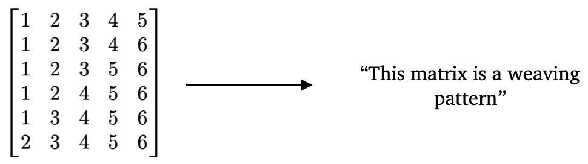

# Finding a Concise Description of Weaving Pattern Matrices (Open Problem)



*Weaving patterns* are size $n \times (n−1)$ matrices with $\{1, 2, \dots , n\}$-
entries introduced by \[1\] to study the number of reduced decompositions of the longest
permutation (which swaps $n$ and $1$, $n$ - $1$ and $2$, etc.) up 
to commutation equivalence. The number
of such objects counts a wide range of combinatorial phenomena, including the number of parallel sorting
networks, the number of rhombic tilings of regular polygons, and is connected to 
the study of the higher Bruhat orders \[2\]. An $O(n^2)$ algorithm for determining
if a given $\{1, 2, . . . , n\}$-matrix is a valid weaving pattern
exists but gives no additional insight into the structure of
weaving patterns and correspondingly the asymptotics of
reduced decompositions. The enumeration of reduced decompositions 
up to commutation equivalence has been studied by many including
Knuth \[3\] and Stanley \[4\]. An exact formula is likely out of reach,
so asymptotic upper and lower bounds are of great interest.
ML models that can detect necessary or sufficient conditions
for a matrix to be a valid weaving pattern have the potential
to lead to substantial improvements in the upper bound.

The enumeration of reduced decompositions up to commutation equivalence has been studied by many including Knuth and Stanley. An exact formula is likely out of reach, so asymptotic upper and lower bounds are of great interest. ML models that can detect necessary or sufficient conditions for a matrix to be a valid weaving pattern have the potential to lead to substantial improvements in the upper bound.

## Dataset 
Each $n \times (n − 1)$ matrix is stored on single line. For instance, the matrix

$$
\begin{bmatrix}
1 & 2 & 3 & 4 & 5 \\\\
1 & 2 & 3 & 4 & 6 \\\\
1 & 2 & 3 & 5 & 6 \\\\
1 & 2 & 4 & 5 & 6 \\\\
1 & 3 & 4 & 5 & 6 \\\\
2 & 3 & 4 & 5 & 6 \\\\
\end{bmatrix}
$$

is represented as

``1,2,3,4,5,1,2,3,4,6,1,2,3,5,6,1,2,4,5,6,1,3,4,5,6,2,3,4,5,6``

note that the matrix is represented in row-major format. An integer representing whether the matrix corresponds to a weaving pattern (‘0’) or not (‘1’) is listed at the same index in the corresponding labels file.

We provide datasets for $n = 8,9,10$.
- [n = 6](https://huggingface.co/datasets/ACDRepo/weaving_patterns_6)
- [n = 7](https://huggingface.co/datasets/ACDRepo/weaving_patterns_7)

This data can be easily downloaded and used via transformers datasets. 

```
from datasets import load_dataset

# Login using e.g. `huggingface-cli login` to access this dataset
ds = load_dataset(DATASET_NAME)
```
In the code snippet above, just replace `DATASET_NAME` with one of the following:
- `'ACDRepo/weaving_patterns_6'`
- `'ACDRepo/weaving_patterns_7'`

### Weaving patterns of size $6$
|| # Weaving patterns | # Non-weaving patterns | Total instances |
|----------|----------|-----------|-----------|
| Train | 634 | 1,116 | 1,750 |
| Test  | 275 | 476 | 751 |

### Weaving patterns of size $7$
|| # Weaving patterns | # Non-weaving patterns | Total instances |
|----------|----------|-----------|-----------|
| Train | 17,388 | 96,012 | 113,400 |
| Test  | 7,310 | 41,290 | 48,600 |

## Data generation

A Java file that generates all weaving patterns for a given value of $n$ can be found above. To sample negatives ($\\{1,2,\dots,n\\}$-entry matrices that are not weaving patterns) we simply took true weaving patterns and shuffled the numbers within each row using numpy's shuffle method, and checked that the resulting matrix is not a positive example. This enforces the same row-level statistics (each row contains exactly one occurrence of each number), so there is no simple 'counting feature' for a neural network to use to differentiate between positive and negative examples.

## Task

**Math question:** Find a concise characterization of those $\{1,2,\dots,n\}$-valued $n \times (n-1)$ matrices that correspond to weaving patterns.

**ML task:** Train a model that can predict whether a $\{1,2,\dots,n\}$-valued $n \times (n-1)$ matrix corresponds to a weaving pattern or not. 

## Small model performance

| Size | Logistic regression | MLP | Transformer | Guessing majority class | 
|----------|----------|-----------|------------|------------|
| $n= 6$ | $70.4$ | $86.1 \pm 0.2$ | $85.9 \pm 2.3$| $63.4$ |
| $n= 7$ | $85.8$ | $99.3 \pm 0.2$ | $99.9 \pm 0.0$| $85.0$ |

The $\pm$ signs indicate 95% confidence intervals from random weight initialization and training.

## References

\[1\] Felsner, Stefan. "On the number of arrangements of pseudolines." Proceedings of the twelfth annual Symposium on Computational Geometry. 1996.  
\[2\] Chau, Herman. "On Enumerating Higher Bruhat Orders Through Deletion and Contraction." arXiv preprint arXiv:2412.10532 (2024).  
\[3\] Knuth, Donald E., ed. Axioms and hulls. Berlin, Heidelberg: Springer Berlin Heidelberg, 1992.  
\[4\] Stanley, Richard P. "On the number of reduced decompositions of elements of Coxeter groups." European Journal of Combinatorics 5.4 (1984): 359-372.
